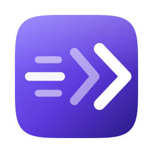

<div align="center">



# spaceflick

**Keep the half-swipe. Lose the half-second.**

[](#install)
[](#install)
[](mac/main.swift)
[](LICENSE)

**[julienr2.github.io/spaceflick](https://julienr2.github.io/spaceflick/)**

</div>

The four-finger space swipe is two things at once. While your fingers are down,
the desktops track them one-to-one — that's the half-swipe you hold to see two
spaces side by side. Then you lift, and the Dock plays a long ease-out before
anything is actually focused.

**spaceflick keeps the first part and deletes the second.** Swipe slowly and it
behaves exactly as before. Flick and you're just *there*. Swipe past the first
or last space and it rubber-bands natively, same as always.

It's one passthrough event tap that rewrites a single number — the release
velocity the Dock reads to decide how fast to finish. Nothing is intercepted,
suppressed, or replayed.

## Install

```sh
brew install julienR2/tap/spaceflick
brew services start spaceflick
```

Then add `/opt/homebrew/opt/spaceflick/bin/spaceflick` to System Settings →
Privacy & Security → **Accessibility** — an event tap can't see the trackpad
without it. No restart needed: spaceflick waits for the grant and starts
working the moment you flip the switch.

It runs as a launchd agent, so it comes back at login and after a reboot. Stop
it with `brew services stop spaceflick`.

<details>
<summary>From source instead, with a proper <code>/Applications</code> app</summary>

```sh
git clone https://github.com/julienR2/spaceflick && cd spaceflick
./build.sh install
```

Uninstall with `./build.sh uninstall`. To try it without installing anything:

```sh
./build.sh && ./build/spaceflick run -v     # swipe a few times, ^C to stop
```
</details>

> Both builds are unsigned, so **an upgrade invalidates the Accessibility
> grant** — macOS keys it to the code signature. If swipes go back to feeling
> slow, remove spaceflick from the Accessibility list and re-add it.

## Best of both worlds

|  | Stock | BTT | yabai | AeroSpace | Blink | **spaceflick** |
|---|:---:|:---:|:---:|:---:|:---:|:---:|
| Near-instant switch | ✕ | ✓ | ✓ | ✓ | ✓ | **✓** |
| **Half-swipe peek preserved** | ✓ | ✕ | ✕ | ✕ | ✕ | **✓** |
| **Keeps the native 4-finger swipe** | ✓ | ✕ | ✕ | ✕ | ✕ | **✓** |
| Native macOS spaces | ✓ | ✓ | ✓ | ✕ | ✓ | **✓** |
| No SIP changes | ✓ | ✓ | ✕ | ✓ | ✓ | **✓** |
| Free & open source | — | ✕ | ✓ | ✓ | ✓ | **✓** |
| Hotkeys, jump to space N | ✓ | ✓ | ✓ | ✓ | ✓ | **✕** |
| Works inside Mission Control | ✓ | ✕ | ✕ | ✕ | ✓ | **✕** |

The two bold rows are the whole reason spaceflick exists. Everything else gets
its speed by *replacing* the gesture — swallowing your swipe and posting a
synthetic one at absurd velocity — which makes the interactive peek impossible,
because there's no finger left to track. spaceflick adjusts your real gesture,
so both rows can be ✓.

The bottom two rows are what it gives up in exchange: no hotkeys, no
jump-to-space-N, nothing inside Mission Control.
[Blink](https://github.com/benkoppe/Blink) has all of that and is a far more
complete app — if you want those, use it.

<details>
<summary>Where these values come from</summary>

I've tested only spaceflick and Blink myself. The
[BetterTouchTool](https://folivora.ai/) (paid, and vastly more general than
this one job), [yabai](https://github.com/koekeishiya/yabai) and
[AeroSpace](https://github.com/nikitabobko/AeroSpace) columns come from their
own documentation plus [Blink's published comparison](https://blink.thekoppe.com/),
on the same criteria it used.

Two notes worth spelling out. yabai reaches instant switching only with SIP
partially disabled and its scripting addition loaded — that's the row below it.
And AeroSpace doesn't switch native spaces at all: it "employs its own emulation
of virtual workspaces instead of relying on native macOS Spaces due to their
considerable limitations", so the gesture rows aren't really a fair fight — it's
solving a different problem, and solving it well.
</details>

## You are not imagining it

This is a long-standing, widely-reported complaint, with no built-in setting:

- [Switching spaces animation is very slow](https://discussions.apple.com/thread/256054548) — Apple Community. *"Even enabling Reduce motion doesn't help — the animation changes, but remains equally slow."*
- [Speed up desktop switching animation in macOS Tahoe](https://discussions.apple.com/thread/256195960) — Apple Community
- [Can I increase the speed of the switch spaces animation?](https://discussions.apple.com/thread/253938203) — Apple Community
- [Switching Spaces is NOT Smooth](https://forums.macrumors.com/threads/switching-spaces-is-not-smooth.2218292/) — MacRumors
- [Space switching is quite slow](https://github.com/koekeishiya/yabai/discussions/1947) — yabai discussion

Two details from those threads worth knowing. It's **worse at high refresh
rates**, so ProMotion Macs have it hardest. And **your keystrokes keep going to
the space you left** until the animation ends — which is why it feels like more
than half a second even when it isn't.

## Options

| flag | default | |
|---|---|---|
| `--velocity N` | `999999` | Claimed release velocity. Lower it (`40`, `60`) for a fast-but-visible slide. |
| `--min-velocity V` | `0.08` | Slower releases pass through untouched, preserving peek-and-let-go. |
| `--vertical` | off | Also flick vertical swipes (Mission Control). |
| `--no-edge-guard` | off | Allow flicking past the first/last space. |
| `--invert` | off | Flip the swipe-direction mapping. |
| `-v` | off | Log every release. |
| `probe` | | Log raw swipe events, change nothing. For when a macOS update moves the private field numbers. |

<details>
<summary><b>How it works, and what doesn't</b></summary>

### The tap

The swipe reaches the Dock as an undocumented event type `30`
(`kCGSEventDockControl`) carrying `kIOHIDEventTypeDockSwipe`, with these private
`CGEventField`s:

| field | meaning |
|---|---|
| `110` | `kIOHIDEventType` — `23` is a Dock swipe |
| `123` | axis — `1` horizontal, `2` vertical |
| `129` / `130` | velocity x / y |
| `132` | phase — `1` began, `2` changed, `4` ended, `8` cancelled |
| `135` | progress bits |

A tap at `.cgSessionEventTap` / `.headInsertEventTap` sits upstream of the Dock,
so a `.defaultTap` there can mutate field `129` on the `phase == 4` event as it
goes past and hand it on. The Dock never knows. Two field reads and one field
write per swipe — no timers, no polling, no space or window queries. Measured
across 19 real swipes: **10ms of CPU total.**

Decisive swipes release at around ±1–5; peeks at around ±0.005. Three orders of
magnitude apart, which is why a fixed `--min-velocity` separates them cleanly.

### The edge guard

A velocity of 999999 asks the Dock for a space index that may not exist, and it
does not clamp — you land on a black screen. So on `began` spaceflick does one
`CGSCopyManagedDisplaySpaces` round-trip (on the display under the pointer) to
find where you are in the ordered space list. If the release heads off either
end, the event is passed through untouched and macOS rubber-bands as usual.

That is one WindowServer call per swipe, at the *start* of the gesture where
nothing is waiting on it. Positive velocity means rightward — the trackpad's
scroll-direction preference is applied upstream, so the sign already encodes
where you are going rather than which way your fingers moved.

### Dead ends, so you can stop looking

| | |
|---|---|
| `defaults write com.apple.dock workspaces-swoosh-animation-off` | Dead. The string isn't in the macOS 26 Dock binary at all. Last worked around 10.7. |
| `defaults write com.apple.dock expose-animation-duration` | Dead since Sierra, and it targeted Mission Control's zoom, never the space slide. |
| Accessibility → Reduce Motion | Works, doesn't help. Swaps the slide for a cross-fade of the same duration, and you lose the interactive tracking. |
| `SLSSetSpaceTransitionDuration` & friends | Don't exist. No `*SpaceTransition*` symbol is exported from SkyLight on macOS 26. |
| `CGSManagedDisplaySetCurrentSpace` | Exists, switches with no animation, but leaves Dock/WindowServer bookkeeping inconsistent — why yabai needs SIP disabled. |

</details>

## Thanks

spaceflick is a small idea on top of other people's reverse engineering.

- **[BetterTouchTool](https://folivora.ai/)** — where the velocity trick came
  from in the first place. Andreas Hegenberg worked out that the Dock's swipe
  events could be spoken to directly, years before anyone wrote it down.
- **[darwin-fast-workspace-switch](https://github.com/RGBCube/darwin-fast-workspace-switch)**
  — reverse engineered BetterTouchTool to recover the private `CGEventField`
  numbers and published them.
- **[InstantSpaceSwitcher](https://github.com/jurplel/InstantSpaceSwitcher)** —
  the compact C implementation that made the technique easy to read, and
  confirmed the field constants independently.
- **[Blink](https://github.com/benkoppe/Blink)** — by far the biggest influence,
  and the reason this exists. It's where I first saw the trick working, and
  reading its source taught me the parts I'd have got wrong on my own: that the
  velocity sign already encodes direction rather than finger motion, that the
  ordered space list has to be read per display, and that an edge guard is not
  optional. Blink does much more than spaceflick — hotkeys, a menu bar,
  jump-to-space-N, wrap-around. If you want those, go get it.
- **[yabai](https://github.com/koekeishiya/yabai)** and
  **[CGSInternal](https://github.com/NUIKit/CGSInternal)** — the long-running
  public record of what the private SkyLight and CoreGraphics space APIs
  actually are.

spaceflick's own contribution is narrow: apply the trick to the real gesture
rather than a synthetic one, so the peek survives.

## License

MIT
